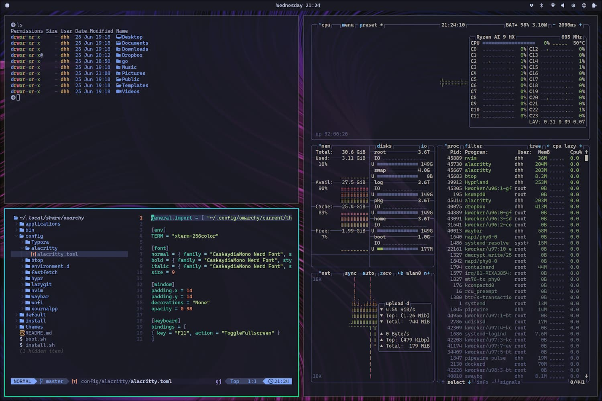

# MK Night Theme for Omarchy

> **Work in Progress**: This theme is currently based on Tokyo Night with custom backgrounds. More customizations and color tweaks are planned for future updates.

A custom dark theme for Omarchy based on the Tokyo Night color palette with curated backgrounds from Raycast Wallpapers.

## Screenshot



## Installation

To install this theme, use the omarchy-theme-install command:

```bash
omarchy-theme-install https://github.com/yourusername/mk-night-theme
```

After installation, activate the theme:

```bash
omarchy-theme-set "Mk Night"
```

### Manual Installation

```bash
git clone https://github.com/yourusername/mk-night-theme ~/.config/omarchy/themes/mk-night
omarchy-theme-set "Mk Night"
```

## Backgrounds

Cycle through backgrounds using: `omarchy-theme-bg-next`

## Credits

- Color scheme based on [Tokyo Night](https://github.com/enkia/tokyo-night-vscode-theme) by Enkia
- Background wallpapers from [Raycast Wallpapers](https://www.raycast.com/wallpapers) (edited)

## License

MIT License - Feel free to use and modify as you wish.
